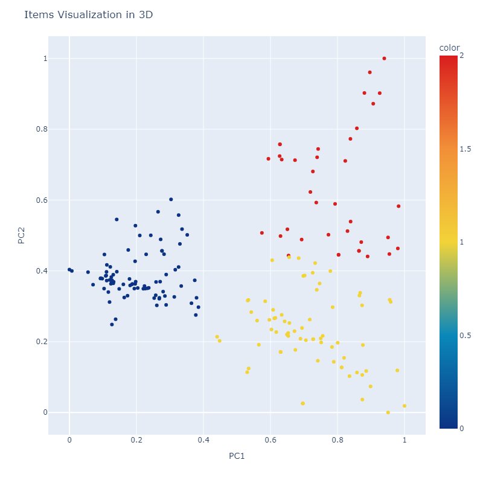
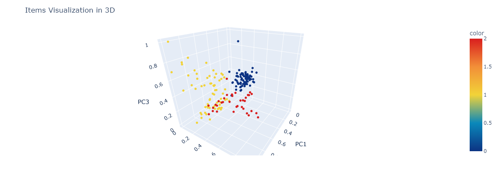
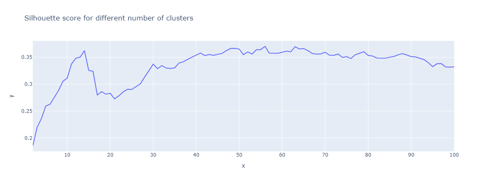

# League of Legends Items Clustering
This readme has been writen by copilot

This repository contains the code for clustering League of Legends items using the dataset provided by [Kaggle](https://www.kaggle.com/datasets/barthetur/league-of-legends-champions-items-stats/data).

## Dataset

The dataset used in this project is sourced from Kaggle and includes various statistics for League of Legends champions and items.

## Objective

The main objective of this code is to classify League of Legends items into different clusters based on their attributes.

## Results

The results of the clustering analysis will be displayed within the notebook, including visualizations of the clusters and insights derived from the data.

## Visualization

The above images show a 2D and a 3D plot of 3 clusters formed by the items based on their attributes.

The first approximation suggests 55 clusters

## Future Improvements

Planned enhancements for this project include:

- Adding silhouette score plots to evaluate the quality of the clusters.
- Optimizing item purchase strategies based on clustering results.
- Analyse the results

Feel free to suggest additional features or improvements.

## File Description

- `items.ipynb`: The Jupyter Notebook containing the code for data preprocessing, clustering, and analysis of the League of Legends items.

## Usage

1. Download the dataset from [Kaggle](https://www.kaggle.com/datasets/barthetur/league-of-legends-champions-items-stats/data).
2. Place the dataset in the same directory as the `items.ipynb` file.
3. Open the `items.ipynb` file in Jupyter Notebook or any compatible environment.
4. Run the cells to preprocess the data and perform clustering.

## Requirements

- Python 3
- Jupyter Notebook
- pandas
- numpy
- scikit-learn
- matplotlib
- seaborn

## License

This project is licensed under the MIT License.

